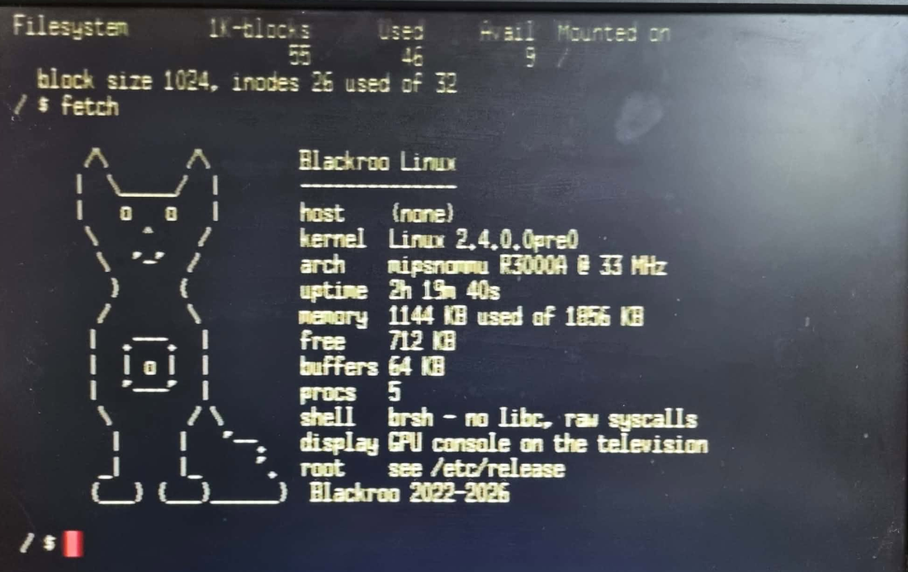

# Blackroo Linux

**Linux 2.4 (uClinux, no-MMU) on a stock Sony PlayStation — MIPS R3000A at
33 MHz, 2 MB of RAM, booting from a CD-R to a shell on the television, typed on
with a real keyboard. No host PC involved.**

```
BIOS ─► kloader (CD) ─► LINUX.EXE ─► psxcd finds ROOT.IMG ─► ext2 ─► /bin/sh
```

The PlayStation was never meant to run an operating system. It has no MMU, no
keyboard port, no disk, and 2 MB of RAM that the kernel very nearly fills by
itself. Everything below is about working around one of those facts.

This is a revival of **Runix**, a PS1 Linux port abandoned around 2007. Its
kernel tree survived; nothing else did. Rebuilding it took three years of
on-and-off research — mostly reading, measuring, and confirming that other
people's notes were right before trusting them.

---

## It works



A real PAL SCPH-750x, two hours nineteen minutes into an uptime, photographed
off the television. Nothing is emulated and no host PC is attached — the shell
is being typed on with a keyboard plugged into the console.

```
/ $ fetch

      /\       /\        Blackroo Linux
     |  \_____/  |       --------------
     |   o   o   |       host    playstation
      \    ^    /        kernel  Linux 2.4.0.0pre0
       \  '-'  /         arch    mipsnommu R3000A @ 33 MHz
        )     (          uptime  2h 19m 40s
       /       \         memory  1144 KB used of 1856 KB
      |  .---.  |        free    712 KB
      |  | o |  |        buffers 64 KB
      |  '---'  |        procs   5
       \       / \       shell   brsh - no libc, raw syscalls
        |     |   '--.   display GPU console on the television
       _|     |_     '.  root    see /etc/release
      (___) (___)______)  Blackroo 2022-2026
```

1856 KB rather than 2048: the top 192 KB is held back from the page allocator
so `binfmt_fixed` has somewhere to load programs. There is no MMU, so a
program's address has to be decided before it runs.

`fetch` reads `uname(2)` and `sysinfo(2)`. There is no `/proc` to read — it was
34 KB, and removing it is part of what paid for that 192 KB window.

---

## Talking to it

The console has no keyboard port and no network. There are two ways in, and
they are not alternatives — most of the work here used both at once.

### A serial cable

The PlayStation's SIO1 port, three wires to a 3.3 V FTDI adapter. This is how
kernels are uploaded, how the boot log is read, and how BRMON is driven. Full
wiring and the pinout are in **Serial reference** below.

Bring the console to kloader's `Serial Shell (115200)` and:

```bash
python3 tools/host/blackroo-serial.py /dev/ttyUSB0 upload output/blackroo.exe
```

### A keyboard, through BlueRetro

The console's controller ports carry a serial bus, and a **BlueRetro** adapter
bridges Bluetooth to it. Put the adapter in keyboard mode and a Bluetooth
keyboard becomes a PlayStation input device; `drivers/char/psxkbd.c` decodes it
and feeds the VT. **That is what unplugs the host PC** — output was already on
the television, and this gave it an input side.

Two things learned doing it, both in `docs/14` and `docs/27`:

- The adapter must be told to *be* a keyboard. It reports what it is — `41 5a`
  for a pad, `96 5a` for a keyboard — and it is worth reading that back before
  suspecting the wiring. "It works in kloader" was misleading, because there it
  was working as a gamepad.
- The protocol carries **events, not state**. Identical frames must not be
  deduplicated, or repeated letters get eaten.

A caveat while the adapter is in keyboard mode: kloader's own menu polls for a
*pad*, so a controller is still needed to drive the menu.

### A mouse — planned

The PlayStation mouse is a real product and speaks the same controller bus,
device ID `0x12`, needing no adapter at all. `docs/14` rejected the homebrew
mouse-keyboard protocol precisely because a genuine mouse is simpler than
emulating one.

It folds into `psxkbd`'s existing poller as one SIO0 input driver rather than a
second one competing for the bus — the memory cards already share that bus, and
`docs/23` records what happens when two drivers fight over it. Hardware is in
hand; it is a prerequisite for the desktop described in `docs/28`.

---

## Build it

```bash
./bootstrap.sh
```

That is the whole thing. It checks the host, names the exact `apt` line for
anything missing, fetches the cross-toolchain, and builds the kernel, the
userland, the bootloader and the disc images. It never runs as root.

Out the other end, in `output/`:

| | |
|---|---|
| `linux.elf` | the kernel |
| `blackroo.exe` | kernel + initrd as a PS-EXE, for serial upload |
| `blackroo_noinitrd.exe` | kernel alone, for `root=` on a real device |
| `ROOT.IMG` | the ext2 filesystem the disc carries |
| `blackroo-kloader.bin` | the disc image, with `.cue` and `.toc` |

**The toolchain is not in this repository.** The kernel needs EGCS 2.91.66 — a
1999 compiler, and the last one this 2.4 no-MMU tree builds cleanly with.
Shipping GCC binaries would oblige this project to ship GCC's source too, for a
tool that is not part of the work. `bootstrap.sh` obtains it; `sdk/README.md`
has the details. The old repository kept it on the main branch, which is why
that history is not carried forward here.

Burning:

```bash
cdrdao write --device /dev/sr0 --driver generic-mmc-raw -n --eject \
    output/blackroo-kloader.toc
```

---

## 1. kloader — getting code to run at all

The PlayStation boots one PS-EXE from a disc and hands it the machine. That is
the only entry point, so everything starts with a loader.

`bootloader/` is **kloader**: a PS-EXE the BIOS loads from `SYSTEM.CNF`, which
draws a menu on the television, reads memory cards, walks video modes, and can
either chain-load a kernel from the disc or accept one over the serial port at
115200 baud.

Two things about it cost real time:

**It overwrote itself.** kloader lives at `0x80010000`, and so did the kernel.
Loading one on top of the other fails at upload offset 6144, every time. The
kernel is linked at `0x80090000` now, clear of kloader's text and its heap.
That fix was originally applied to `arch/mipsnommu/ld.script` — which is
*generated*, and deleted by `make clean`, so it silently reverted four days
later and every kernel built that night was broken again. The address lives in
`arch/mipsnommu/Makefile` now, where `clean` cannot reach it.

**Debugging it needed a CD-R per attempt** until it was linked at a second
address (`-DBLACKROO_TEST_HIGH`, `0x80090000`) so that a *running* kloader could
upload the next build of itself over serial. Seven seconds a cycle instead of
ten minutes.

### Disc authoring, and the licence problem

A burned CD-R is rejected by a stock console no matter what is on it — that is
the wobble groove, which is physical and cannot be written. A modchip answers
it. But there is a *second* check, and a modchip does not cover it: sectors
12–15 of the disc must hold a valid licence area, in Mode 2 Form 2. `mkpsxiso`
writes those sectors with empty bodies, and the console hangs at the SCE screen
with no logo and no error.

`iso/build-iso.sh` transplants the first 16 sectors from a known-good image.
`LICENSEE.DAT` is PAL, `LICENSEA.DAT` is NTSC-U. Four CD-Rs went into learning
this. Verify a burn with `dd if=/dev/sr0 bs=2048`, never with
`cdrdao --read-raw`, which returns zeroes on some drives and looks like a
failed burn.

---

## 2. Memory cards — the first writable storage

Before there was a CD driver there had to be *somewhere* to keep a filesystem.
The PlayStation's answer is a 128 KB memory card on a serial bus shared with the
controllers, and `drivers/block/bu.c` presents up to eight of them — through a
multitap — as one block device, `/dev/bul`, 508 KB joined.

Three separate faults hid behind one symptom ("no cards found"):

- **A lost-wakeup race.** The card's acknowledge interrupt could arrive before
  the driver slept waiting for it, so it slept forever. This is why detection
  worked in emulators and failed on hardware.
- **The multitap was never addressed.** `0x81 + floor` was right; `floor` was
  always zero.
- **Stock Sony cards are rejected on purpose.** `bu.c` only accepts a card whose
  block 0 carries its own magic, so a factory card reads as "not found" until it
  is formatted.

Then a fourth, and it is the most useful lesson in this repository: the driver
only worked with its debug printing enabled. The print latency was supplying a
2 ms settle the hardware needed after asserting the card select line. **If a
driver only works with debug output on, the bug is timing.**

Writing to a card also needs the sector number placed *after* two dummy bytes,
not immediately after the command. Getting that wrong made the card read part of
a magic number as a sector address and answer "bad sector" — and it stayed
hidden for a long time because only sector 0 was ever read, where both layouts
give the same answer.

---

## 3. The CD-ROM — 700 MB, and a driver nobody had written

No Linux or BSD port of the PlayStation has ever had a working CD-ROM driver.
`drivers/block/psxcd.c` is one: major 209, serving 2048-byte sectors through the
Linux block layer, with the root filesystem mounted from the disc.

It was built by **proving each step in the monitor before writing any driver
code.** `arch/mipsnommu/ps/brmon.c` is an in-kernel serial monitor, and it gained
a `cd` command first — `cd init`, `cd stat`, `cd rd <lba>` — polled, PIO, no DMA
and no interrupt handler. The point was to make the command path the only
unknown. Every command answered with the interrupt the documentation predicted,
and the first sector read came back correct on the first attempt.

DMA came next, the same way: `cd cmp <lba>` reads a sector by both PIO and DMA
and compares all 2048 bytes. Identical at two different addresses, so the data
path was proven before anything depended on it. The cache question was settled
by comparing cached and uncached views of the same buffer — zero bytes differed,
so DMA needs no invalidate. That is a property of the R3000A, whose "data cache"
is wired as scratchpad, and it is the kind of thing worth confirming rather than
assuming.

Things the hardware insists on, each found by poking at it:

- **8-bit reads only.** A 32-bit read of a CD port returns one byte four times.
- **`Setloc` before every `ReadN`.** A bare `ReadN` after a `Pause` re-delivers
  the sector you already had — silent corruption in a block device.
- **`Pause` only on a discontinuity**, and then wait it out. The controller
  ignores commands for about a second afterwards. Issuing `Setloc` and `ReadN`
  into that window makes both appear to succeed while actually returning the
  *previous* command's answer. An INT3 where INT1 was expected is the signature.
- **This kernel is linked in KUSEG**, so a symbol's address is already its
  physical address. The obvious uncached alias, `addr | 0x20000000`, lands
  537 MB into a 2 MB machine and hangs the console with no output at all.

The disc's root filesystem is found by reading the ISO9660 volume descriptor and
walking the root directory for `ROOT.IMG`, so **the disc can be rebuilt without
rebuilding the kernel** — no LBA is compiled in. `tools/host/iso-find.py` runs
the same lookup on the host, against the `.bin`, before a CD-R is spent.

---

## Serial reference: wiring, and poking at the hardware

The PlayStation has a serial port on the back (SIO1). It is the only way in
before there is a keyboard, and it stays the most useful way to look at the
machine afterwards.

### Wiring

**Three wires. The PS1's SIO port is 3.3 V logic** — an FTDI FT232R is the safe
choice, and a 5 V TTL adapter can damage the console. Cross TX and RX.

```
        PS1 SIO1 (rear)                 USB adapter
   ┌─────────────────────┐
   │  8  7  6  5  4      │        pin 2  GND  ───── GND
   │  3  2  1            │        pin 5  RXD  ───── TXD
   └─────────────────────┘        pin 8  TXD  ───── RXD
```

No handshake lines are needed — CTS and DSR are optional and unconnected, so a
low CTS reading means nothing here. 115200 baud, 8N1.

**Find the port by what answers, not by what it is called.** It has been
`ttyUSB0` and `ttyUSB1` on different days, and a Bluetooth pad adapter is a
third serial device on the same machine. The wrong port is silent, which reads
exactly like a dead console:

```bash
python3 tools/host/blackroo-serial.py /dev/ttyUSB0 diag
```

That listens for kloader's `BK>>` beacon and reports what it sees. One of your
ports will answer.

### Uploading a kernel

With kloader on screen, choose **Serial Shell (115200)**, then:

```bash
python3 tools/host/blackroo-serial.py /dev/ttyUSB0 upload output/blackroo.exe
```

About 10.4 KB/s, so roughly 80 seconds for a kernel. `--cmdline "root=..."`
overrides the command line, which is how a root device can be tested **without
burning a disc** — the kernel arrives over the wire and the disc in the drive
supplies the filesystem.

`scripts/serial-autoupload.sh` does the same on a retry loop, so the console can
be brought to the menu whenever rather than to a stopwatch.

### BRMON — poking at the hardware

Put `brmon` on the kernel command line and the kernel stops in an in-kernel
monitor **before it mounts anything**, with the machine otherwise idle. A panic
drops into it too. This is where every driver in this repository was proven
before it was written:

```
blackroo> cpu                 CPU, cache and COP0 state
blackroo> mem                 memory map and free pages
blackroo> hw                  detected hardware
blackroo> peek 1f801814       read a 32-bit register
blackroo> poke 1f801814 ...   write one
blackroo> md 80010000 100     dump memory
blackroo> card                memory card slots and sizes
blackroo> cd rd 16            read a CD sector, polled, no DMA
blackroo> cd cmp 16           read it twice — PIO vs DMA — and compare
blackroo> blk d1 0 10 800     read through the Linux block layer
blackroo> kbd                 decode keyboard frames live
blackroo> cont                carry on booting
```

`cd cmp` is worth singling out. It is how the DMA path was proven: read the same
sector both ways and compare all 2048 bytes. If they match at two different
addresses, the data path is correct, and everything built on top of it can be
trusted.

The monitor has no interrupts, no scheduler and no other users of the bus
competing with it, so a failure there is wiring or protocol — not a race in
somebody else's driver. That property is the entire reason it exists.

---

## 4. Userspace — a shell on a machine with no memory protection

With no MMU there is no `fork()`, no demand paging, no copy-on-write and no
address-space isolation. Programs are loaded at one fixed address by
`fs/binfmt_fixed.c`, into a window held back from the page allocator by telling
the kernel there is less RAM than there is.

That window is 192 KB, and it was paid for by taking 96 KB out of the kernel —
not by compiler flags, which were worth 2,400 bytes on this compiler, but by not
linking things that cannot be used: `/proc`, the whole networking stack
(`CONFIG_NET` was already off, but 2.4 builds `socket.o` and `net/core`
regardless), pseudo-terminals, the entropy pool, the module loader.

`userland/brsh.c` is the shell, and it is also the utilities: `ls`, `cat`,
`hexdump`, `stat`, `cd`, `pwd`, `mkdir`, `rmdir`, `rm`, `cp`, `mv`. Freestanding,
raw syscalls, no libc. One program image is resident at a time, so an external
`/bin/ls` could not run *while the shell was running* even if it existed.

Output goes to the television through the GPU console and is mirrored to the
serial port. Input comes from a real keyboard on the controller bus, decoded by
`drivers/char/psxkbd.c` — which means the PlayStation needs no host PC at all.

---

## Credits

```
Chelson Aitcheson    project lead - research, hardware bring-up, integration
Hoang Haviss         initrd and early userspace
The Runix project    the original PS1 no-MMU kernel port (~2003-2007)
```

Hoang's work is still load-bearing: `HoangFlag` in `blackroo/Makefile` sets the
include path on every compile of every file in the kernel.

`docs/29-LINEAGE-AND-ROADMAP.md` traces what came from Runix, what was written
here, and what is left.

## Where the knowledge came from

| | |
|---|---|
| **Runix** (~2003–2007) | The original PS1 Linux port. Its kernel tree is the base; its documentation was recovered from the Wayback Machine. |
| **psx-spx** | The hardware reference for the CD-ROM controller, DMA, interrupts and the disc format. |
| **PSn00bSDK** | kloader links its runtime (MPL 2.0), and its `psxcd` sources are the model for the ISO9660 lookup and the drive's timing quirks. |
| **PCSX-Redux** | Its bare-metal shell and reverse-engineered BIOS state machine document the command sequences a real BIOS uses. |
| **JaCzekanski's `ps1-tests`** | Timing measured on real hardware, with the logs committed. The highest authority here, and the source of the numbers. |
| **DuckStation** | The most detailed seek model available, and a set of "hardware tests show…" comments worth reading. |

Full per-component attribution is in [`SOURCE-ATTRIBUTION.md`](SOURCE-ATTRIBUTION.md).

---

## Licence

GPL v2 — see [`COPYING`](COPYING). The kernel, the bootloader and the shell are
all GPL v2, and the complete corresponding source ships on the disc itself as
`SOURCE.TGZ` rather than as a written offer.

kloader links **PSn00bSDK**, whose libraries are **MPL 2.0**. This project does
not modify them; they are at https://github.com/Lameguy64/PSn00bSDK.

`mkpsxiso`, used to author the discs, is GPL v2 or later and is a separate
project.

The PlayStation BIOS is not here and is not part of this project.

---

*The history in this repository was reconstructed from `CHANGELOG.md`, which was
kept from the beginning. The work was done without version control until now.*
